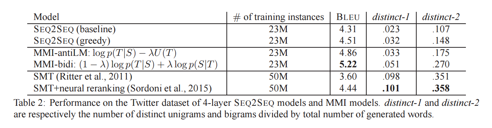
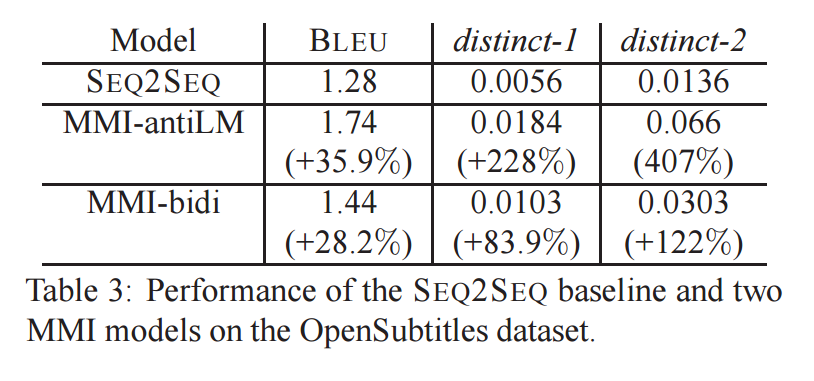

[A Diversity-Promoting Objective Function for Neural Conversation Models](https://arxiv.org/pdf/1510.03055.pdf) 2016

Jiwei Li, Michel Galley, Chris Brockett, Jianfeng Gao, Bill Dolan
**__**
In our training dataset from the OpenSubtitles database (OSDb), 0.45% sentences contain the sequence I don’t know, a high rate considering huge diversity of this dataset.

**_seq2seq_**

Sordoni et al., 2015; Shang et al., 2015; Vinyals and Le, 2015; Wen et al., 2015; Serban et al., 2016

## 1. Introduction

#### **_第一段_**
1. 什么是conversational agent（对话代理，对话机器人）？面临的主要挑战是：鲁棒性（robustness），可扩展性（scalability），领域适用性（domain adaptation）
2. 关注度已经转移到从数据中学习对话模式（conversational pattern），data-driven generation：SMT， rerank， seq2seq
3. seq2seq模型提供了promise of 可扩展性和语言独立性，还有（together with）能间接捕捉语义和语法关系，并捕捉语境依赖。以一种SMT不可能的方式。

#### **_第二段_**
1. 一个engaging的response generation系统应该能够输出满足语法的，一致的回复并且是多样且有趣的。
2. 实际上，神经对话模型趋向于生成不重要（trivial）和（non-committal）的response， 经常包含高频短语along the lines of **_I don't know_** or **_I'm OK_**（Sordoni et al., 2015; Vinyals and Le,
2015; Serban et al., 2016）
3. Table 1证实了这个现象，展示了seq2seq的最高输出的回复。
4. 所有top-ranked回复都是generic的。
5. 更有意义或具体的回复可以在N-best列表中找到，但是排序较低。
6. In part at least(某部分来讲), 这个行为可以表述为generic reponse在对话数据集中 “_I don't know_”的频率，in contrast with the relative sparsity of 更有内容的回复。
7. 神经模型疯爱给“safe”Response较高的概率，是通过优化给定输入的输出的**似然（likelihood）**达到的。
8. This objective function， common in相关的task such as MT，可能对一些本质上要求多样性的生成任务不合适（Conversation， caption）。
9. Intuitively, it seems adj.（desireable） to take into account **_not only_** ...(the dependency of responses on messages), **_but also_** ...(the inverse), the likelihood that a message will be provided to a given response.

#### **_第三段_**
1. We propose to capture this intuition by using Maximum Mutual Infomation(MMI), 首先由（Bahl et al., 1986; Brown, 1987）在语音识别领域提出，作为一个优化函数，评价输入和输出的相互依赖。
2. Below，我们提出了practical strategies for neural generation models that 用MMI作为一个目标函数。
3. We show that 使用MMI的结果能减少generic response sequences，生成对应的更多样和有趣的输出。

## 2. Dataset

#### **_Twitter Conversation Triple Dataset_**
**_Extension of_**: Sordoni et al. (2015)

**_23M_** conversation snippets

####  **_OpenSubtitles database_**
Training: roughly 60M - 70M

Development, test: **_2K_** pairs; length range of [6, 18] [[IMSDB]](http://www.imsdb.com/)

