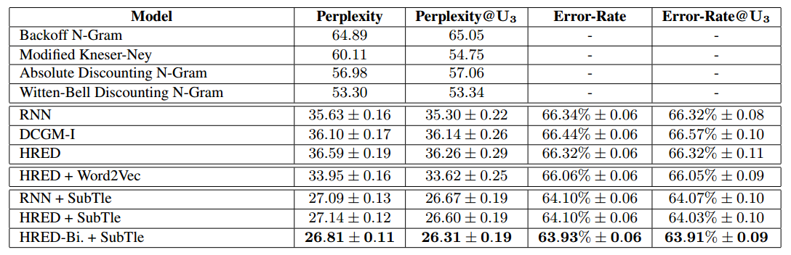

[Building End-to-End Dialogue Systems Using Generative Hierarchical Neural Network Models](https://www.aaai.org/ocs/index.php/AAAI/AAAI16/paper/view/11957/12160)

## 1. Dataset

#### _**MovieTriples**_: Moive-Dic
Banchs, R. E. 2012. Movie-DiC: A movie dialogue corpus for research and development. In Proceedings of the 50th Annual
Meeting of the Association for Computational Linguistics, 203–207.

#### **_Scale_**
|                     | Training  | Validation  | Test  |
| ------------------  |:---------:| :----------:|:-----:|
| Movies              | 484       | 65          | 65    |
| Triples             | 196,308   | 24,717      | 24,717|
| Avg. tokens/triples | 53        | 53          | 55    |
| Avg. unk/triple     | 0.97      | 1.22        | 1.19  |

#### **_Result_**
